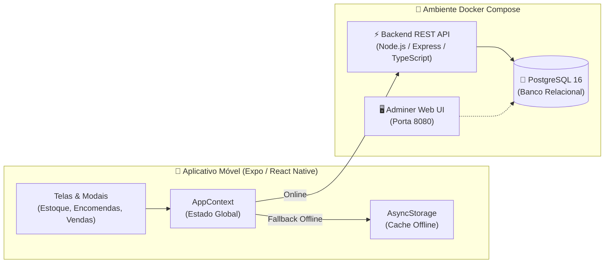

# 📱 iStock - Gestão de Estoque, Encomendas e Vendas de iPhone

Sistema completo para gestão comercial de iPhones (estoque, encomendas e vendas), composto por um **aplicativo móvel em React Native (Expo)** conectado a uma **API REST com banco de dados relacional PostgreSQL via Docker Compose**, projetado com suporte a modo híbrido **Offline-First**.

---

## 🏗️ Arquitetura do Sistema



---

## 📚 Documentação Técnica Completa

Para detalhes aprofundados sobre cada camada, consulte os documentos na pasta [`docs/`](./docs):

* 📐 [**Arquitetura do Sistema (ARCHITECTURE.md)**](./docs/ARCHITECTURE.md): Detalhamento das camadas, diagramas de sequência, padrão de resiliência e decisões de design.
* 🗄️ [**Modelagem do Banco de Dados (DATABASE.md)**](./docs/DATABASE.md): Diagrama Entidade-Relacionamento (ERD), dicionário de tabelas, índices de performance e regras de integridade.
* 🌐 [**Especificação da API REST (API.md)**](./docs/API.md): Contratos de todos os endpoints HTTP, payloads JSON de requisição e resposta.
* 🐳 [**Guia Docker & Execução (DOCKER.md)**](./docs/DOCKER.md): Instruções passo a passo para subir containers, configurar variáveis de ambiente e conectar dispositivos físicos via Wi-Fi.

---

## 🚀 Como Executar o Projeto

### 1. Inicie o Banco de Dados e a API (Docker)

Na raiz do projeto, execute:

```bash
docker compose up -d
```

> **Verificação:** Acesse [http://localhost:3000/health](http://localhost:3000/health) no navegador. Você verá:
> `{"status":"ok","service":"istock-backend-api","database":"connected"}`.

*Para inspecionar as tabelas no navegador pelo Adminer, acesse [http://localhost:8080](http://localhost:8080).*

---

### 2. Inicie o Aplicativo Móvel (Expo Go)

Em outro terminal:

```bash
npm start
```

* **No Celular (iOS/Android):** Abra o app **Expo Go** e escaneie o QR Code gerado no terminal.
* **No Navegador Web:** Pressione `w` no terminal.
* **No Emulador Android:** Pressione `a` no terminal.
* **No Simulador iOS:** Pressione `i` no terminal.

> 💡 **Nota de Conexão Móvel:** O app possui indicador de conexão no topo da tela. Se estiver usando o celular físico via Wi-Fi, configure o seu IP local em [`src/services/api.ts`](./src/services/api.ts). Se o backend estiver desligado, o app funciona automaticamente no **Modo Local (Offline)** usando o cache local!

---

## ✨ Funcionalidades Principais

### 1. 📦 Gestão de Estoque Atual
* Cadastro completo de iPhones (Modelo do 11 ao 16 Pro Max, Armazenamento, Cor original, Bateria %, Condição estética e IMEI).
* Preços de custo e venda com cálculo automático de margem e lucro previsto.
* Filtros rápidos por status (Disponíveis, Reservados, Vendidos) e condição (Lacrados vs Seminovos).
* Busca em tempo real por Modelo, IMEI, Cor ou Fornecedor.
* Ações rápidas de Vender, Editar, Excluir e Compartilhar Anúncio no WhatsApp.

### 2. 🚚 Controle de Encomendas (Pre-orders)
* Registro de pedidos sob demanda com adiantamento/sinal de clientes.
* Cálculo automático do saldo devedor restante.
* Fluxo de status: `Pendente` ➜ `A Caminho` ➜ `No Estoque (Recebido)` ➜ `Entregue ao Cliente`.
* Transição com 1 clique: **Receber no Estoque** transfere o aparelho automaticamente para a aba de Estoque com status `'reservado'`.

### 3. 💰 Registro de Vendas & Lucro Líquido
* Registro transacional de vendas com baixa automática de estoque ou pedido.
* Formas de pagamento: Pix, Cartão de Crédito (até 18x), Débito, Dinheiro e Misto.
* Gerador de comprovante de venda compartilhável via WhatsApp.

### 4. 📊 Dashboard de Indicadores em Tempo Real
* Valuation total do estoque (Custo total vs Valor esperado de venda).
* Lucro projetado no estoque atual e total de sinais retidos em caixa.
* Métricas consolidadas calculadas em SQL no PostgreSQL.
* Gráfico de distribuição de modelos mais frequentes e saúde da bateria.

---

## 🛠️ Tecnologias Utilizadas

| Camada | Tecnologia | Função |
| :--- | :--- | :--- |
| **Frontend Mobile** | React Native & Expo SDK | Interface nativa multiplataforma (iOS/Android) |
| **Linguagem** | TypeScript | Tipagem estrita e segurança em tempo de compilação |
| **Persistência Local** | AsyncStorage | Cache offline e fallback automático |
| **Backend API** | Node.js & Express | Servidor REST intermediário com endpoints estruturados |
| **Banco de Dados** | PostgreSQL 16 | Banco relacional com índices e constraints |
| **Infraestrutura** | Docker & Docker Compose | Containerização e orquestração do ambiente |
| **Visualizador BD** | Adminer | Gerenciamento visual web de tabelas e queries |
