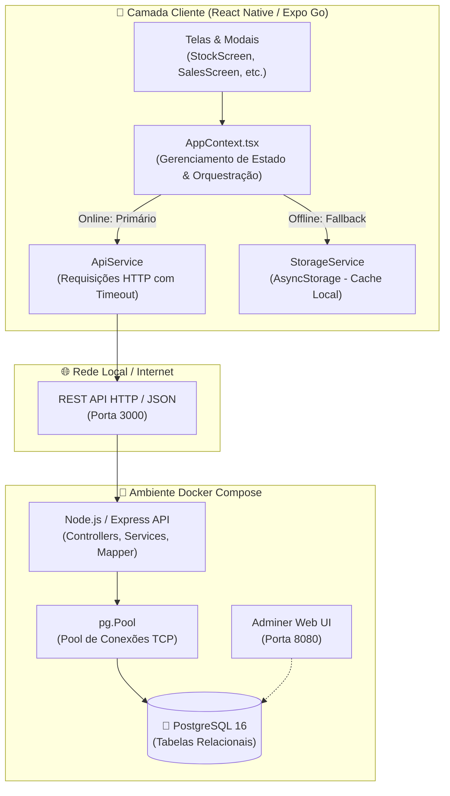
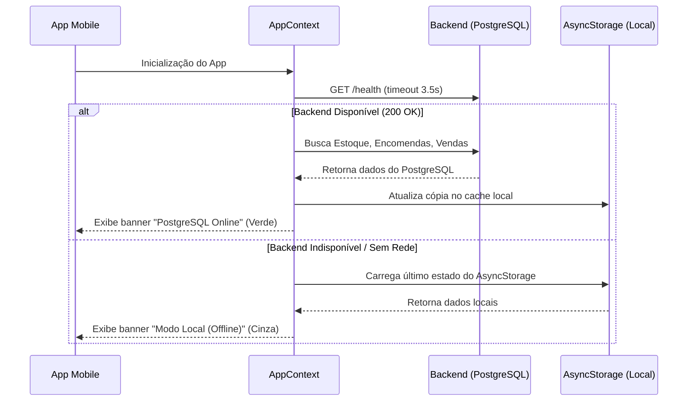

# 🏗️ Arquitetura do Sistema iStock

Este documento descreve a arquitetura do aplicativo móvel **iStock**, abrangendo a camada de apresentação móvel (React Native / Expo), a camada de serviços intermediária (REST API) e a camada de persistência relacional (PostgreSQL via Docker).

---

## 📌 1. Visão Geral

O iStock adota uma arquitetura em camadas orientada a serviços com suporte a modo **Offline-First** e **Graceful Degradation**.



---

## 🧩 2. Camadas do Sistema

### 2.1. Camada Móvel (Mobile Client)
* **Framework:** React Native 0.81+ com Expo SDK 54 / 57.
* **Linguagem:** TypeScript estrito (`strict: true`).
* **Estado Global:** React Context API centralizado em [`src/context/AppContext.tsx`](../src/context/AppContext.tsx).
* **Persistência Local (Offline Cache):** [`@react-native-async-storage/async-storage`](../src/services/storage.ts).
* **Design System & Estilização:** Tokens semânticos centralizados em [`src/theme/colors.ts`](../src/theme/colors.ts).

### 2.2. Camada de API (Backend REST)
* **Runtime:** Node.js 20 (Alpine Linux).
* **Framework Web:** Express 4.x com CORS habilitado e body-parser JSON nativo.
* **Driver de Banco:** `pg` (node-postgres) com gerenciamento de conexões via `Pool`.
* **Mapeamento de Dados (DTO Mapper):** Conversão bidirecional entre o padrão `snake_case` do PostgreSQL e o `camelCase` tipado das interfaces TypeScript do aplicativo.
* **Health Check Ativo:** Endpoint `/health` que verifica dinamicamente se o pool do banco está respondendo.

### 2.3. Camada de Banco de Dados (PostgreSQL)
* **Versão:** PostgreSQL 16 Alpine.
* **Isolamento de Portas:** Porta exposta no host `5433:5432` por padrão (customizável via `.env`), evitando conflitos com outros servidores PostgreSQL que já estejam rodando na porta `5432` da máquina.
* **Volume Persistente:** `istock_postgres_data` montado em `/var/lib/postgresql/data`.
* **Inicialização Automática:** Script SQL inicial montado em `/docker-entrypoint-initdb.d/init.sql` executado na primeira criação do banco.

---

## 🔄 3. Estratégia Offline-First & Graceful Degradation

Um dos principais diferenciais da arquitetura é a **resiliência de conexão**:



* **Zero Falhas:** O aplicativo **nunca trava ou fica em tela branca** caso o usuário abra o app no celular sem ter ligado o Docker no computador.
* **Transparência:** A interface exibe no topo uma pílula informativa indicando o status atual de conexão com atalho para reconectar.

---

## 📂 4. Estrutura de Diretórios

```text
MOBILE_SOFTWARE/
├── docker-compose.yml       # Orquestração do PostgreSQL, API e Adminer
├── .env.example             # Modelo de variáveis de ambiente
├── App.tsx                  # Ponto de entrada do aplicativo móvel
├── server/                  # Backend Node.js / Express
│   ├── Dockerfile           # Multi-stage build para produção
│   ├── package.json         # Dependências do backend
│   ├── tsconfig.json        # Configurações TypeScript do servidor
│   ├── sql/
│   │   └── init.sql         # Esquema DDL e dados de demonstração
│   └── src/
│       ├── db.ts            # Pool de conexões PostgreSQL e Mappers
│       ├── index.ts         # Servidor Express e middlewares
│       └── routes/          # Rotas REST da aplicação
├── src/                     # Código-fonte do aplicativo móvel
│   ├── components/          # Componentes visuais reutilizáveis e modais
│   ├── context/             # Gerenciamento de estado (AppContext)
│   ├── screens/             # Telas principais (Stock, Orders, Sales, Dashboard)
│   ├── services/            # Serviços de API e Storage
│   │   ├── api.ts           # Cliente HTTP com fallback e timeout
│   │   └── storage.ts       # Armazenamento chave-valor offline
│   ├── theme/               # Paleta de cores e design tokens
│   └── types/               # Tipos e interfaces de domínio
└── docs/                    # Documentação técnica completa
    ├── ARCHITECTURE.md      # Este documento
    ├── DATABASE.md          # Modelagem de dados e dicionário
    ├── API.md               # Especificação dos endpoints REST
    └── DOCKER.md            # Guia de execução e troubleshooting
```
