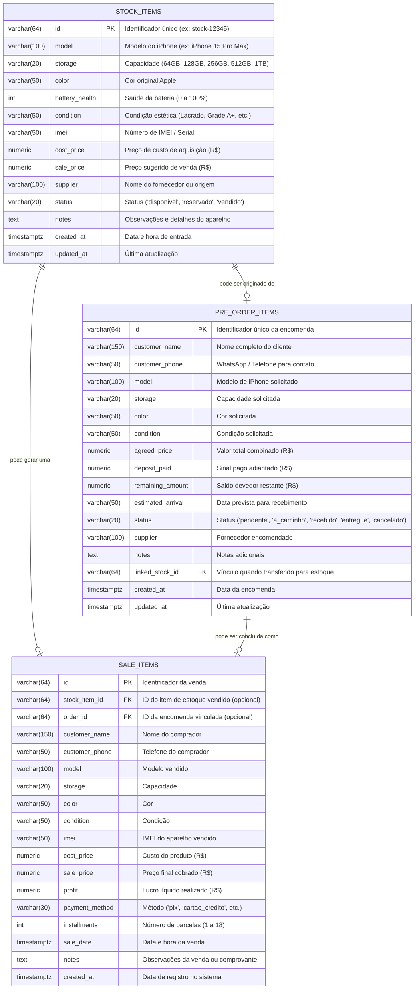

# 🗄️ Modelagem do Banco de Dados PostgreSQL

Este documento apresenta a modelagem de dados relacional utilizada pelo **iStock**, detalhando as tabelas, índices, relacionamentos e regras de integridade no PostgreSQL.

---

## 📐 1. Diagrama Entidade-Relacionamento (ERD)

---

## 📋 2. Dicionário de Dados

### 2.1. Tabela: `stock_items`
Armazena todos os aparelhos físicos que estão ou estiveram no estoque da loja.

| Coluna | Tipo | Restrições | Descrição |
| :--- | :--- | :--- | :--- |
| `id` | `VARCHAR(64)` | `PRIMARY KEY` | Identificador único alfanumérico. |
| `model` | `VARCHAR(100)` | `NOT NULL` | Modelo do iPhone (ex: iPhone 15 Pro). |
| `storage` | `VARCHAR(20)` | `NOT NULL` | Armazenamento (ex: `128GB`, `256GB`, `512GB`, `1TB`). |
| `color` | `VARCHAR(50)` | `NOT NULL` | Cor do aparelho. |
| `battery_health` | `INTEGER` | `NOT NULL, CHECK (0..100)` | Percentual de saúde da bateria. |
| `condition` | `VARCHAR(50)` | `NOT NULL` | Novo / Lacrado, Seminovo Grade A+, A, B ou C. |
| `imei` | `VARCHAR(50)` | `NOT NULL` | IMEI do aparelho. |
| `cost_price` | `NUMERIC(10,2)`| `NOT NULL DEFAULT 0.00` | Preço pago na aquisição. |
| `sale_price` | `NUMERIC(10,2)`| `NOT NULL DEFAULT 0.00` | Preço de venda praticado. |
| `supplier` | `VARCHAR(100)` | `NULLABLE` | Fornecedor ou cliente que fez a troca. |
| `status` | `VARCHAR(20)` | `CHECK ('disponivel', 'reservado', 'vendido')` | Situação comercial do aparelho. |
| `notes` | `TEXT` | `NULLABLE` | Observações sobre estado, acessórios e garantia. |
| `created_at` | `TIMESTAMPTZ` | `DEFAULT NOW()` | Data de inclusão. |
| `updated_at` | `TIMESTAMPTZ` | `DEFAULT NOW()` | Data da última alteração. |

### 2.2. Tabela: `pre_order_items`
Controla pedidos sob encomenda de clientes com sinal retido em caixa.

| Coluna | Tipo | Restrições | Descrição |
| :--- | :--- | :--- | :--- |
| `id` | `VARCHAR(64)` | `PRIMARY KEY` | Identificador da encomenda. |
| `customer_name` | `VARCHAR(150)`| `NOT NULL` | Nome do cliente. |
| `customer_phone`| `VARCHAR(50)` | `NOT NULL` | WhatsApp / Telefone para notificações. |
| `model` | `VARCHAR(100)`| `NOT NULL` | Modelo desejado. |
| `storage` | `VARCHAR(20)` | `NOT NULL` | Capacidade desejada. |
| `color` | `VARCHAR(50)` | `NOT NULL` | Cor desejada. |
| `condition` | `VARCHAR(50)` | `NOT NULL` | Condição desejada. |
| `agreed_price` | `NUMERIC(10,2)`| `NOT NULL` | Valor acordado para a venda. |
| `deposit_paid` | `NUMERIC(10,2)`| `DEFAULT 0.00` | Valor do adiantamento/sinal recebido. |
| `remaining_amount`| `NUMERIC(10,2)`| `DEFAULT 0.00` | Saldo a pagar (`agreed_price - deposit_paid`). |
| `status` | `VARCHAR(20)` | `CHECK ('pendente', 'a_caminho', 'recebido', 'entregue', 'cancelado')` | Etapa do fluxo logístico. |
| `linked_stock_id`| `VARCHAR(64)`| `REFERENCES stock_items(id)` | ID do item criado no estoque ao receber. |

### 2.3. Tabela: `sale_items`
Histórico de vendas realizadas, apuração de lucro líquido e formas de pagamento.

| Coluna | Tipo | Restrições | Descrição |
| :--- | :--- | :--- | :--- |
| `id` | `VARCHAR(64)` | `PRIMARY KEY` | Identificador único da transação. |
| `stock_item_id` | `VARCHAR(64)` | `REFERENCES stock_items(id)` | Vínculo com o aparelho vendido. |
| `order_id` | `VARCHAR(64)` | `REFERENCES pre_order_items(id)` | Vínculo com a encomenda atendida. |
| `customer_name` | `VARCHAR(150)`| `NOT NULL` | Nome do cliente. |
| `sale_price` | `NUMERIC(10,2)`| `NOT NULL` | Valor final cobrado. |
| `cost_price` | `NUMERIC(10,2)`| `NOT NULL` | Custo do aparelho vendido. |
| `profit` | `NUMERIC(10,2)`| `NOT NULL` | Lucro líquido (`sale_price - cost_price`). |
| `payment_method`| `VARCHAR(30)` | `CHECK ('pix', 'cartao_credito', etc.)` | Forma de recebimento. |
| `installments` | `INTEGER` | `DEFAULT 1` | Quantidade de parcelas no cartão. |
| `sale_date` | `TIMESTAMPTZ` | `DEFAULT NOW()` | Data de realização da venda. |

---

## ⚡ 3. Índices de Performance

Para garantir respostas instantâneas mesmo com grandes volumes de dados, foram criados índices nos seguintes campos:

* `stock_items`:
  * `idx_stock_status`: Acelera a filtragem de aparelhos disponíveis, reservados e vendidos.
  * `idx_stock_model`: Otimiza a busca por modelo na barra de pesquisa.
  * `idx_stock_imei`: Permite busca rápida por IMEI no recebimento/conferência.
* `pre_order_items`:
  * `idx_orders_status`: Acelera a contagem e listagem de encomendas ativas.
  * `idx_orders_customer`: Otimiza a busca por nome de cliente.
* `sale_items`:
  * `idx_sales_date`: Permite agregações ultra-rápidas para faturamento mensal e anual.
  * `idx_sales_model`: Otimiza rankings de modelos mais vendidos.
